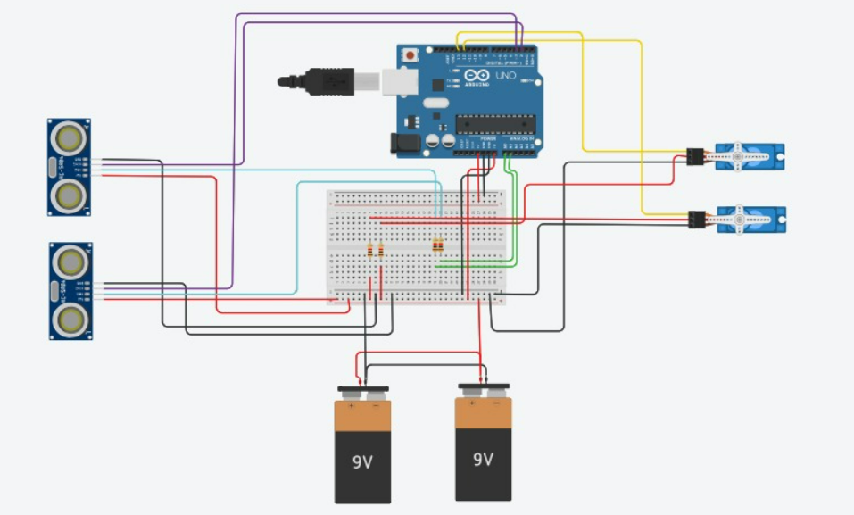

# POUBELLE INTELLIGENTE

| | |
|-|-|
|`Mihalcea Andreea-Elena` | 

## Description
J'ai développé un projet de séparation des déchets basé sur Arduino, qui peut trier automatiquement les déchets plastiques et métalliques en utilisant des capteurs et des actionneurs. De plus, notre projet peut également détecter lorsque la poubelle est pleine et alerter l'utilisateur ou le service de gestion des déchets.

## Motivation
 L'une des principales problématiques environnementales auxquelles nous sommes confrontés aujourd'hui est l'élimination et le recyclage corrects des déchets. Beaucoup de ces déchets, comme le plastique et le métal, peuvent être réutilisés ou recyclés s'ils sont séparés du reste des ordures. Cependant, le tri manuel des déchets est fatigant, chronophage et inefficace. C'est pourquoi nous avons décidé de créer une telle poubelle qui aide à résoudre le problème du recyclage des emballages en plastique et en métal.

## Architecture
L'architecture du système comprend :
Arduino Mega: Agit comme l'unité de contrôle centrale.
Fils de Connexion : Facilitent les connexions entre les composants sur une plaque d'essai.
2x Module Ultrasonique HC-SR04
2x Moteur Servo MICRO SERVO TOWER PRO 9G : Contrôle l'ouverture et la fermeture du couvercle de la poubelle.
2x Capteur de proximité inductif (PNP, sortie NO, 6 ~ 12 V)
2x Batterie 9~12V
2x Poubelle
2x Led
3x Resistors
Breadbord

### Block diagram
Le schéma de bloc représente visuellement les connexions entre l'Arduino Uno, le capteur ultrasonique, le moteur servo et les autres composants.
<!-- Make sure the path to the picture is correct -->

### Schematic

### Components

<!-- This is just an example, fill in with your actual components -->

| Device | Usage | Price |
|--------|--------|-------|
| Arduino Mega | Contrôleur principal | [73 RON](https://www.optimusdigital.ro/ro/compatibile-cu-arduino-mega/471-placa-de-dezvoltare-compatibila-cu-arduino-mega-2560-atmega2560-ch340.html?search_query=%09Placa+de+dezvoltare+compatibila+cu+Arduino+MEGA+2560+%28ATmega2560+++CH340%29&results=5) |
| 2x Moteur Servo MICRO SERVO TOWER PRO 9G | Mouvement du couvercle | [28 RON](https://www.optimusdigital.ro/ro/motoare-servomotoare/26-micro-servomotor-sg90.html?search_query=Micro+Servomotor+SG90+90%C2%B0&results=9) |
|2x Capteur de proximité inductif |  | [30 RON](https://cleste.ro/pro-signal-psg-jmp150mm-jumper-cable-male-to-male-connectors-150mm-length-pack-of-10-arduino-beaglebone-pachet.html) |
|Fils de Connexion | Connexions des composants | [16 RON](https://www.optimusdigital.ro/ro/senzori-senzori-de-distanta/3753-senzor-de-metal-normal-deschis-lj12a34zbx.html?search_query=Senzor+Inductiv+de+Proximitate+LJ12A34Z%2FBX&results=1) |
|2x Module Ultrasonique HC-SR04|  | [20 RON](https://ardushop.ro/ro/electronica/47-modul-senzor-ultrasonic-detector-distanta.html?search_query=Ultrasonic&results=5) |
| Breadbord|  | [25 RON](https://ardushop.ro/ro/electronica/163-kit-breadboard830-65xfire-jumper-sursa-alimentare-335v.html) |

### Libraries

<!-- This is just an example, fill in the table with your actual components -->

| Library | Description | Usage |
|---------|-------------|-------|
| Arduino Mega | Une carte de microcontrôleur|Agit comme l'unité de contrôle centrale pour gérer les différents composants  |
| [Servo.h | Manages servo motor | Used for accesing the peripherals of the microcontroller  |
| InductiveSensor | Gère les capteurs de proximité inductifs | Détecter des objets métalliques près des poubelles |
| Module Ultrasonique HC-SR04|Gère le module ultrasonique HC-SR04 |mesurer la distance avec les capteurs ultrasoniques  |
| Battery | La source d'alimentation | Alimente l'Arduino et tous les composants connectés  |
| Resistor | Composant électronique utilisé pour limiter le courant | protéger des composants comme les LED de recevoir trop de courant |
| Fils | Gère la communication I2C pour divers capteurs |Facilite la communication entre l'Arduino et les appareils I2C si nécessaire |
| Breadbord | Un outil pour le prototypage des circuits | Used for accesing the peripherals of the microcontroller  |

## Conception Logicielle
Utilise la bibliothèque Servo.h pour contrôler le moteur servo qui manipule le couvercle de la poubelle. L'algorithme détecte la distance des objets et commande le moteur servo pour ouvrir ou fermer le couvercle en fonction de la distance détectée.

## Résultats Obtenus
Le prototype fonctionnel a été capable de détecter les objets et d'opérer automatiquement le couvercle de la poubelle. Les tests ont montré une réaction fiable à la présence d'objets dans la plage définie.

## Conclusions
Amélioration du recyclage : La poubelle intelligente améliore l'efficacité du tri des déchets en séparant automatiquement les matériaux recyclables comme le plastique et le métal, réduisant ainsi la nécessité d'un tri manuel.
Facilité d'utilisation : Grâce à la détection automatique des objets et à l'ouverture/fermeture automatisée des couvercles, la poubelle intelligente offre une solution pratique et hygiénique pour la gestion des déchets.
Impact environnemental positif : En facilitant le recyclage et en alertant les utilisateurs lorsque la poubelle est pleine, le système contribue à une gestion plus durable des déchets et à la réduction de l'impact environnemental.

## Reference links

<!-- Fill in with appropriate links and link titles -->

[Tutorial 1](https://www.youtube.com/watch?v=LIy0Gwm06-M&ab_channel=SKCETECE01)
[Tutorial 2](https://youtu.be/9yrP1CZN3Ds?si=0rI5M6pl-R9oE0Vp)
[Tutorial 3](https://www.insightfulinkwalk.com/2019/08/arduino-trash-separation-project.html)

